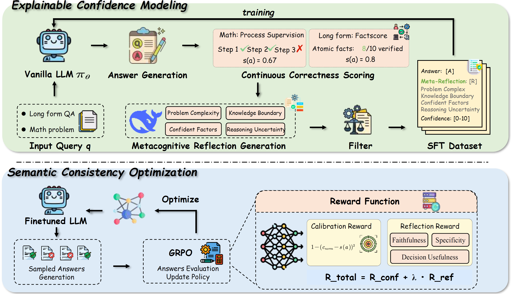

# 🧠 MetaConf: Learning Explainable Confidence via Metacognitive Reflection in Large Language Models

<div align="center">

[](https://www.python.org/downloads/)
[](https://pytorch.org/)
[](LICENSE)
[](https://arxiv.org/abs/XXXX.XXXXX)

*A framework for learning explainable confidence in large language models through metacognitive reflection*

</div>

## 📋 Overview

MetaConf is a framework for learning explainable confidence in large language models through metacognitive reflection. The approach enables models to generate detailed self-reflections alongside confidence scores, improving both calibration and interpretability.

### 🎯 Key Contributions

- 🔍 **Metacognitive Reflection**: Models perform first-person introspection to assess reasoning processes and knowledge boundaries
- 📊 **Explainable Confidence**: Generate detailed confidence explanations rather than simple numerical scores
- 🚀 **Two-Stage Training**: Supervised fine-tuning followed by GRPO reinforcement learning
- ⚖️ **Multi-dimensional Rewards**: Calibration error, reflection quality, and accuracy optimization



## 🏗️ Architecture

The framework consists of two main training stages:

1. **🎓 Stage 1 - Supervised Fine-Tuning (SFT)**
   - Uses LlamaFactory for supervised fine-tuning
   - Trains models to generate answers with confidence scores and reflections
   - Prepares foundation for reinforcement learning

2. **🤖 Stage 2 - GRPO Reinforcement Learning**
   - Implements Group Relative Policy Optimization
   - Multi-dimensional reward function combining calibration, reflection quality, and accuracy
   - Optimizes model behavior through reward-based learning

### 🔧 Core Components

- 🚀 **Training Pipeline**: `train/grpo_train.py` - Main GRPO training implementation
- 🎯 **Reward Function**: `utils/reward_function.py` - Multi-dimensional reward calculation
- 💭 **Reflection Prompts**: `prompts/reflection_generation.py` - Metacognitive reflection templates
- ⚙️ **Configuration**: `configs/` - Training and model configuration files

## 🚀 Quick Start

### ⚙️ Environment Setup

```bash
# Clone repository
git clone https://github.com/username/metaconf.git
cd metaconf

# Create environment
conda create -n metaconf python=3.9
conda activate metaconf

# Install dependencies
pip install -r requirements.txt

# Set environment variables
export DEEPSEEK_API_KEY="your-api-key"
export DEEPSEEK_BASE_URL="https://api.deepseek.com"
```

### 🎯 Training

#### Stage 1: Supervised Fine-Tuning

This initial stage fine-tunes the base model on a high-quality dataset of fact-based question-answering pairs. This pre-aligns the model, making the subsequent RL training more stable and effective. We use the [LLaMA-Factory](https://github.com/hiyouga/LLaMA-Factory) framework for this stage.

📝 **Example LLaMA-Factory SFT Configuration**: Below is an example YAML configuration for running the SFT. You can adapt the parameters for your specific setup.
```bash
# llama_factory_sft.yaml
### model
model_name_or_path: /path/to/your/base_model 
deepspeed: /path/to/your/ds_z3_config.json

### method
stage: sft
do_train: true
finetuning_type: lora
lora_target: q_proj,v_proj
lora_rank: 256
lora_alpha: 512

### dataset
dataset: your sft dataset  
template: llama3
cutoff_len: 3072
overwrite_cache: true
preprocessing_num_workers: 16

### output
output_dir: /path/to/your/output_dir 
logging_steps: 10
save_steps: 500
plot_loss: true
overwrite_output_dir: true
save_strategy: 'no'

### train
per_device_train_batch_size: 2
gradient_accumulation_steps: 1
learning_rate: 1.0e-5
num_train_epochs: 4.0
lr_scheduler_type: cosine
warmup_ratio: 0.1
fp16: true
ddp_timeout: 180000000
```

#### Stage 2: GRPO Training

```bash
# Run GRPO training
python train/grpo_train.py --config configs/grpo_train_config.yaml
```

### ⚙️ Configuration

Main training parameters in `configs/grpo_train_config.yaml`:

```yaml
# Model parameters
model_name_or_path: "/your/model/path"
max_steps: 40
learning_rate: 1e-6
beta: 0.001

# GRPO parameters
num_generations: 8
max_prompt_length: 256
max_completion_length: 2048
```

## 📚 Citation

If you use this code in your research, please cite:

```bibtex
@article{metaconf2025,
  title={MetaConf: Learning Explainable Confidence via Metacognitive Reflection in Large Language Models},
  author={xxx},
  journal={xxx},
  year={xxx}
}
```

## 📄 License

This project is licensed under the MIT License - see the [LICENSE](LICENSE) file for details.

---

<div align="center">

**⭐ If this project helps you, please give us a star! ⭐**

</div>
